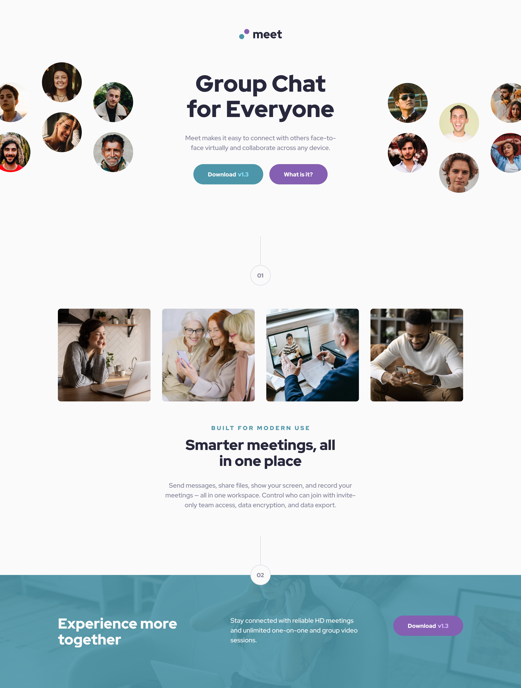
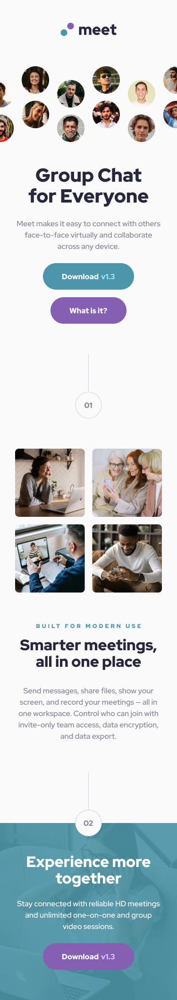

# Frontend Mentor - Meet landing page solution

This is a solution to the [Meet landing page challenge on Frontend Mentor](https://www.frontendmentor.io/challenges/meet-landing-page-rbTDS6OUR). Frontend Mentor challenges help you improve your coding skills by building realistic projects.

## Table of contents

- [Overview](#overview)
  - [The challenge](#the-challenge)
  - [Screenshot](#screenshot)
  - [Links](#links)
- [My process](#my-process)
  - [Built with](#built-with)
  - [What I learned](#what-i-learned)
  - [Continued development](#continued-development)
  - [Useful resources](#useful-resources)
- [Author](#author)

## Overview

### The challenge

Users should be able to:

- View the optimal layout depending on their device's screen size
- See hover states for interactive elements

### Screenshot




### Links

- Solution URL: [GitHub Repository](https://github.com/your-username/meet-landing-page)
- Live Site URL: [Live Demo](https://your-live-site-url.com)

## My process

### Built with

- Semantic HTML5 markup
- CSS custom properties (CSS variables)
- Flexbox
- CSS Grid
- Mobile-first workflow
- Red Hat Display font family
- Responsive design principles

### What I learned

This project helped me practice several key concepts:

**CSS Custom Properties for Design Systems:**
```css
:root {
  --color-primary: #4D96A9;
  --color-secondary: #855FB1;
  --color-text-dark: #28283D;
  --color-text-gray: #87879D;
  --font-family: 'Red Hat Display', sans-serif;
}
```

**Responsive Hero Layout with Absolute Positioning:**
```css
.hero-images {
  position: relative;
  min-height: 300px;
}

.hero-image-left,
.hero-image-right {
  position: absolute;
  top: 50px;
}

.hero-image-left { right: 65%; }
.hero-image-right { left: 65%; }
```

**Flexible Section Dividers:**
```css
.section-divider {
  display: flex;
  flex-direction: column;
  align-items: center;
}

.divider-number {
  width: 56px;
  height: 56px;
  border-radius: 50%;
  background-color: var(--color-white);
}
```

### Continued development

Areas I want to continue focusing on:

- **Advanced CSS Grid layouts** - Exploring more complex grid patterns for future projects
- **CSS animations and transitions** - Adding subtle micro-interactions to enhance user experience
- **Accessibility improvements** - Implementing better ARIA labels and keyboard navigation
- **Performance optimization** - Image optimization and critical CSS techniques

### Useful resources

- [CSS Custom Properties Guide](https://developer.mozilla.org/en-US/docs/Web/CSS/Using_CSS_custom_properties) - Helped me implement a consistent design system
- [Flexbox Guide](https://css-tricks.com/snippets/css/a-guide-to-flexbox/) - Essential for creating flexible layouts
- [Red Hat Display Font](https://fonts.google.com/specimen/Red+Hat+Display) - The typography choice for this project

## Author

- Website - [Your Name](https://www.your-site.com)
- Frontend Mentor - [@yourusername](https://www.frontendmentor.io/profile/yourusername)
- GitHub - [@yourusername](https://github.com/yourusername)
# meet-landing-page
